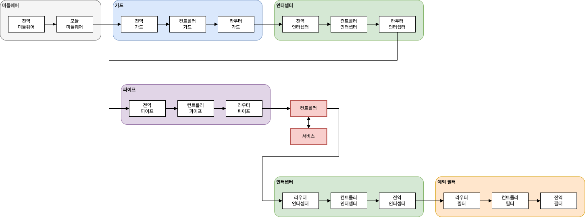

## 인터셉터로 요청과 응답을 입맛에 맞게 바꾸기

-----------------------

### 인터셉터

* 인터셉터는 요청과 응답을 가로채서 변형을 가할수 있는 컴포넌트 이다.
* 인터셉터는 관점지향프로그래밍 에서 영향을 받았다.
  * 메서드 실행 전/후 추가 로직을 바인딩
  * 함수에서 반환된 결과를 변환
  * 함수에서 던져진 예외를 변환
  * 기본기능의 동작을 확장
  * 특정 조건에 따라 긴능ㄹ 완전히 재정의(캐싱)
* 인터셉터는 미들웨어와 수행하는 일이 비슷하지만 수행 시점의 차이가 있다
* 미들웨어는 요청이 라우트 핸들러로 전달되기 전에 동작하며 인터셉터는 요청에 대한 라우트 핸들러의 처리 전/후 호출되어 요청과 응답을 다룰수 있다.
* 미들웨어는 여러개의 조합이 가능해 각기 다른 목적을 가진 미들웨어 로직을 수행할수 있다.
* 다른 미들웨어가 다음 미들웨어에 제어권을 넘기지 않고 요청/응답 주기를 끝내는 일도 가능하다.
* 라우트 핸들러가 요청을 처리하기 전후에 어떤 로그를 남기고 싶다는 요구사항이 있다 가정하는 LoggingInterceptor 를 만든다.
```
@Injectable()
export class LoggingInterceptor implements NestInterceptor{ // 1
    intercept(context: ExecutionContext, next: CallHandler<any>): Observable<any> | Promise<Observable<any>> { // 2
        console.log('....Before') // 3
        const now = Date.now();
        return next
            .handle()
            .pipe(
                tap(() => console.log(`After...${Date.now() - now}ms`)) // 4
            )
    }
}
```
1. 인터셉터는 @nestjs/common 패키지에서 제공하는 NestInterceptor 인터페이스를 구현한 클래스이다.
2. nestIntercerptor 인터페이스의 intercept 함수를 구현해야 한다.
3. 요청이 전달되기 전 로그를 출력한다.
4. 요청을 처리한후 로그를 출력한다.
* 인터셉터를 적용하기 위한 특정 컨트롤러나 메서드에 @UseInterceptors() 를 이용한다
* 전역으로도 사용가능하다
```
async function bootstrap() {
    ....
    app.useGlobalInterceptors(new LoggingInterceptor())
    ....
}
bootstrap();

....Before
After...0ms
```
* NestInterceptor 의 정의
```
export interface NestInterceptor<T = any, R = any> {
    intercept(context: ExecutionContext, next: CallHandler<T>): Observable<R> | Promise<Observable<R>>;
}
```
* 인수로는 2개가 전달된다.
* 두번째 인수 CallHandler 인데 이 인테페이스는 handle() 메서드를 구현해야 한다.
* handle() 메서드는 라우트 핸들러에서 전달된 응답 스트림을 돌려주고 RxJS 의 Observable 로 구현되어 있다.
* 만약 handle() 메서드를 호출하지 않으면 라우터 핸들러가 동작하지 않는다.
* handle()을 호출하고 Observable 을 수신한 후 응답 스트림에 추가 작업을 수행할수 있다.

### 응답과 예외 매핑

* 전달받은 응답에 변형을 가할수 있다.
* 라우터 핸들러에서 전달한 응답을 객체로 감싸서 전달하도록 하는 TransformInterceptor
```
import { CallHandler, ExecutionContext, Injectable, NestInterceptor } from '@nestjs/common';
import { Observable } from 'rxjs';
import { map } from 'rxjs/operators';
export interface Response<T> {
  data: T;
}
@Injectable()
export class TransformInterceptor<T> implements NestInterceptor<T, Response<T>> {
  intercept(context: ExecutionContext, next: CallHandler): Observable<Response<T>> {
    return next
      .handle()
      .pipe(map(data => {
        return { data }
      }));
  }
}
```
* TransformInterceptor Generic 타입 T 으로 선언되어 있다. 
* NestInterceptor 인터페이스 정의를 보면 Generic 으로 T, R 타입 2개로 선언하도록 되어있다
* 둘다 any 타입이기 때문에 어떤 타입이 와도 상관없다
* T 는 응답 스트림을 지원하는 Observable 타입이어야 하고 R 은 응답의 값을 Observable 로 감싼 타입을 정해줘야 한다.
* 타입스크립트로 타입을 명확하게 지정하면 안전하게 코딩할수 있다.
* TransformInterceptor 의 T 는 any 타입이고 R 은 Response 객체를 지정했다.
* Response 객체는 요구사항에 맞게 정의한 타입 data 속성을 갖게 강제한다.
* TransformInterceptor 를 전역으로 사용하기 위해 main.ts 에 지정해줄수 있다.
```
async function bootstrap() {
  app.useGlobalInterceptors(
    new TransformInterceptor(),
  );
  ..........
}
bootstrap();
```
* 컨트롤러에서 에러를 잡아서 변경할수 있다.
* 예외를 변환하는것보다 예외필터를 다루는것이 더 나은 생각이다.
```
@Injectable()
export class ErrorsInterceptor implements NestInterceptor {
  intercept(context: ExecutionContext, next: CallHandler): Observable<any> {
    return next
      .handle()
      .pipe(
        catchError(err => throwError(() => new BadGatewayException())),
      );
  }
}

@UseInterceptors(ErrorsInterceptor)
@Get(':id')
findOne(@Param('id') id: string) {
    throw new InternalServerErrorException();
}
```

### 유저서비스에 인터셉터 적용

```
@Injectable()
export class LoggingInterceptor implements NestInterceptor{
    constructor(private logger:Logger) {}
    intercept(context: ExecutionContext, next: CallHandler<any>): Observable<any>{
        const { method, url, body } = context.getArgByIndex(0); // 1
        this.logger.log(`Request to ${method} ${url}`); // 2
        return next
            .handle()
            .pipe(
                tap(data => this.logger.log(`Response from ${method} ${url} \n response: ${JSON.stringify(data)}`)) // 3
            )
    }
}
```
1. 실행 콘텍스트에 포함된 첫번째 객체를 얻어온다. 이객체로부터 요청 정보를 얻을수 있다.
2. 요청의 HTTP 메서드와 URL 을 로그로 출력한다.
3. 응답 로그에도 HTTP 메서드와 URL 과 함꼐 응답 결과를 출력한다.
* LoggingInterceptor 를 AppModule 에 적용하지 말고 LoggingModule 로 분리하여 적용
```
@Module({
  providers: [
    Logger,
    {provide: APP_INTERCEPTOR, useClass: LoggingInterceptor}
  ],
  ....
})
export class LoggerModule { }

@Module({
  imports: [
      LoggerModule,
  ],
  ......
export class AppModule {}

[MyApp] Info Response from GET /users/01H958DXCKGMBP3JR7ZM63YA74
 response: {"id":"01H958DXCKGMBP3JR7ZM63YA74","name":"","email":"@naver.com"}
```

### 요청 생명주기

* 요청 생명주기 혹은 요청 / 응답 생명주기는 들어온 요청이 어떤 컴포넌트를 거쳐서 처리되고 생성된 응답은 또 어떤 컴포넌트를 거쳐 처리되는지 말한다.

#### 미들웨어

* 미들웨어는 실행순서가 정해져 있다.
* 먼저 전역으로 바인딩된 미들웨어를 실행한다
* 이후 모듈에 바인딩 되는 순서대로 실행한다.
* 다른 모듈에 바인딩 되어 있는 미들웨어들이 있으면 먼저 루트 모듈에 바인딩된 미들웨어를 실행하고 imports 에 정의한 순서대로 실행된다.

#### 가드

* 가드 역시 전역으로 바인딩된 가드를 먼저 시작한다.
* 그리고 컨트롤러에 정의된 순서대로 실행된다.
```
@UseGuard(Guard1, Guard2)
@Controller('users')
export class UsersController{
  constructor(private usersService: UsersService){}
  @UseGuard(Guard3)
  @Get()
  getuser():users[]{
    return this.usersService.getUsers();
  }
}
```
* Guard1, 2, 3 순서대로 실행

#### 인터셉터

* 인터셉터의 실행 순서는 가드와 유사하다.
* 다만 한가지 알아야 할점은 인터셉터는 RxJS 의 Observable 객체를 반환하는데 이는 요청의 실행순서와 반대로 동작한다.
* 요청은 전역 -> 컨트롤러 -> 라우터 순서대로 동작하지만
* 응답은 라우터 -> 컨트롤러 -> 전역 순서대로 동작한다.

#### 파이프

* 파이프는  동작 순서가 독특하다
* 파이프가 여러 레벨에 적용되어 있다면 순서대로 적용한다.
* 특이한점은 파이르가 적용된 라우터의 매개변수가 여러개 있을때 정의한 역순으로 적용된다.
```
@UsePipe(GeneralValidationPipe)
@Controller('users'(
export class UsersController{
  constructor(private usersService: UsersService){}
  @UsePipe(RouteSpecificPipe)
  @Patch(':id')
  updateUser(
    @Body() body: UpdateUserDTO,
    @Param() params: UpdateUserParams,
    @Query() query: UpdateUserQuery,
  ){
    return this.usersService.updateUser(body, params, query);
  }
}
```
* updateUser 함수에 파이프가 둘다 적용되었는데 GeneralValidationPipe -> RouteSpecificPipe 순으로 적용된다.
* 하지만 파이프를 적용하는 매개변수는 query -> params -> body 순으로 적용된다.
* 즉 GeneralValidationPipe 가 query -> params -> body 순서대로 적용하고
* RouteSpecificPipe 도 query -> params -> body 순서대로 적용한다.

#### 예외필터

* 유일하게 필터는 전역필터가 먼저 적용되지 않는다.
* 라우터 -> 컨트롤러 -> 전역 바인딩 순서대로 동작한다.
* 필터가 예외를 잡으면 다른 필터가 동일하게 예외를 잡을수 없다.

#### 일반적인 요청/응답 생명주기


