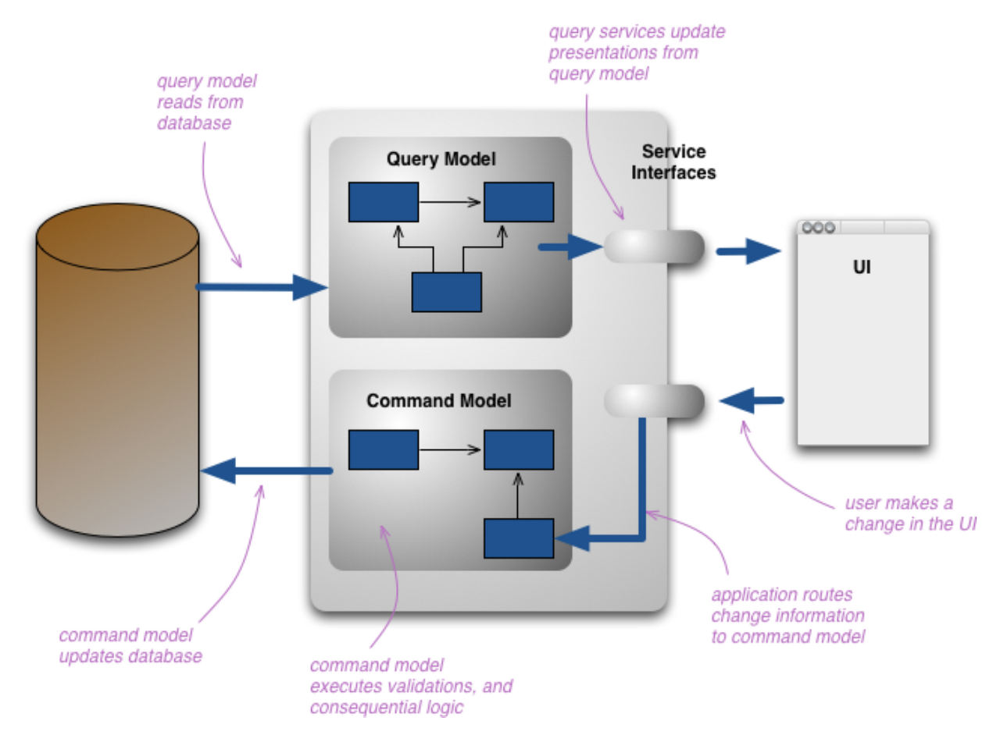

## CQRS 를 이용한 관심사 분리

--------------------------

### CQRS 패턴

* CQRS(command query responsibility separation) 패턴은 명령, 조회 를 분리하여 성능과 확장성 및 보안성을 높일수 있도록 해주는 아키텍처 패턴이다.
* 데이터를 조회한쪽에서는 현재의 복잡한 모델 구조의 데이터가 필요하지 않은 경우가 대부분 이므로 조회시 모델과 데이터를 업데이트 할때의 모델을 다르게 가져가도록 한다.



* CQRS 는 다음과 같은 이점이 있다.
  * CQRS 를 사용하면 몇가지 복잡한 도메인을 다루기 더 쉽다.
    * CQRS 사용하면 복잡성이 추가되기 때문에 생산성이 감소한다. 
    * 모델을 공유하는것이 도메인을 다루기 더 쉬운지 면밀히 판단해야 한다. 
    * 특히 시스템 전체가 아닌 도메인 주도 설계에서 말하는 bounded context 내에서만 사용해야 한다.
  * 고성능 차리가 필요한 애플리케이션을 다루는 경우
    * CQRS 를 사용하면 읽기 및 쓰기 작업에서 로드를 분리하여 각각을 독립적으로 확장할수 있다.
    * 클라우드 DB 를 사용한다면 손쉽게 읽기, 쓰기 DB 를 분리할수 있다
    * 성능을 위해 쓰기는 RDB 읽기는 DocumentDB 를 사용하는 경우가 많다
    * 애플리케이션에서 읽기와 쓰기 사이에 큰 성능 차이가 있는 경우 CQRS 를 쓰면 편하다
    * 또한 양쪽에 서로 다른 최적화 전략을 적용할수 있다.
* CQRS 를 사용하면 자연스럽게 다른 아키텍처 패턴과 잘 어울리게 된다.
  * CRUD 를 통해 상호작용하는 단일표현 에서 작업기반 UI 로 쉽게 이동한다. 예를들어 ReservationStatus 를 RESERVED 로 설정 이라는 명령을 룸 예약으로 변경한다.
  * 이벤트 기반 프로그래밍 모델과 잘 맞다. 이를 통해 이벤트 소싱을 쉽게 활용할수 있다.
  * 최종 일관성을 사용할 가능성이 높아진다.
  * 도메인을 사용할 경우 업데이트할때 많은 로직이 필요하므로 EagerReadDerivation 을 사용하여 쿼리측 모델을 단순화 하는것이 합리적일수 있다.
  * 쓰기모델이 모든 업데이트에 대한 이벤트를 생성하는 경우 읽기 모델을 별도로 구성하여 과도한 데이터베이스 상호작용을 필할수 있다.
  * CQRS 는 복잡한 도메인을 다루고 DDD 를 적용하는데 적합하다.

### 유저 서비스에 CQRS 적용하기

* Nest 에서 제공하는 CQRS 모듈이 있다. `npm i @nestjs/cqrs`로 패키지 설치가 가능하다.
```
@Module({
  .........
  imports: [
      ...........
      CqrsModule,
  ],
})
export class UsersModule {}
```

#### 커맨드

* CRUD 는 커맨드를 이용하여 처리하는데 커맨드는 서비스 계층이나 컨트롤러 게이트웨이에서 직접 발송할수 있다.
* 전송한 커맨드는 커맨드 핸들러가 받아서 처리하한다.
* 유저 생성 로직을 커맨드로 처리하기
```
export class CreateUserCommand implements ICommand{
    constructor(
        readonly name: string,
        readonly email: string,
        readonly password: string,
    ) {}
}
```
* 컨트롤러에서 유저 생성 요칭이 왔을때 직접 UsersService 의 함수 호출하지 말고 커맨드를 전달하도록 한다.
```
import {
    Body,
    Controller,
    Get,
    Param,
    Post,
    Query,
    Headers,
    UseGuards,
    Inject,
    InternalServerErrorException, LoggerService, Logger, BadRequestException
} from '@nestjs/common';
import { AuthGuard } from 'src/auth.guard';
import { AuthService } from 'src/auth/auth.service';
import { CreateUserDto } from './dto/create-user.dto';
import { UserLoginDto } from './dto/user-login.dto';
import { VerifyEmailDto } from './dto/verify-email.dto';
import { UserInfo } from './UserInfo';
import { UsersService } from './users.service';
import {WINSTON_MODULE_NEST_PROVIDER, WINSTON_MODULE_PROVIDER} from "nest-winston";
import {Logger as WinstonLogger} from "winston";
import {CommandBus} from "@nestjs/cqrs";
import {CreateUserCommand} from "./command/create-user.command";

@Controller('users')
export class UsersController {
    constructor(
        private commandBus: CommandBus // 1
    ) { }


    @Post()
    async createUser(@Body() dto: CreateUserDto): Promise<void> {
        const { name, email, password } = dto;
        const command = new CreateUserCommand(name, email, password);
        return  this.commandBus.execute(command) // 2
    }
```
1. @nest/cqrs 패키지에서 제공하는 CommandBus 를 주입한다.
2. 이전에 정의한 CreateUserCommand 를 전송한다.
* UserController 는  더이상 UsersService 에 의존하지 않는다.
* CreateUserCommand 를 처리하는 CreateUserHandler 를 만든다.
```
@Injectable()
@CommandHandler(CreateUserCommand)
export class CreateUserHandler implements ICommandHandler<CreateUserCommand>{

    constructor(
        private dataSource: DataSource,
        private eventBus: EventBus,
        @InjectRepository(UserEntity) private usersRepository: Repository<UserEntity>,
    ) {}
    
    async execute(command: CreateUserCommand){
        const {name, email, password} = command;
        ......
    }
}
```
* UsersModule 에 프로바이더로 CreateUserHandler 를 제공한다.
```
@Module({
    .....
    providers: [CreateUserHandler],
})
export class UsersModule { }
```

#### 이벤트

* 회원가입 이메일 전송 로직을 호원 가입 이벤트를 통해 처리하도록 해본다.
* UserCreatedEvent 를 발송하도록 변경하고 뒤에서 설명할 이벤트 핸들러 동작을 위해 TestEevent 도 함께 발송한다.
```
async execute(command: CreateUserCommand){
    .....
    this.eventBus.publish(new UserCreatedEvent(email, signupVerifyToken));
    this.eventBus.publish(new TestEvent());
}

export class UserCreatedEvent extends CqrsEvent implements IEvent{
    constructor(
        readonly email: string,
        readonly signupVerifyToken: string,
    ) {
        super(UserCreatedEvent.name);
    }
}
export class TestEvent extends CqrsEvent implements IEvent{
    constructor() {
        super(TestEvent.name);
    }
}
export abstract class CqrsEvent {
  constructor(readonly name: string) { }
}
```
* UserCreatedEvent 와 TestEvent 는 CqrsEvent 를 상속 받는다.
* 이는 @nestjs/cqrs 패키지에서 제공하는것이 아닌 이벤트 핸들러에서 이벤트를 구분하기 위해 만든 추상 클래스이다.
* 이벤트 핸들러의 구현을 보면 커맨드 핸들러와 다르게 여거 이벤트 같은 이벤트 핸들러가 받도록 할수 있기 때문이다.
* 커맨드와 마찬가지로 이벤트를 처리할 이벤트 핸들러를 만들고 프로바이더로 제공해야 한다.
```
@EventsHandler(UserCreatedEvent, TestEvent)
export class UserEventsHandler implements IEventHandler<UserCreatedEvent | TestEvent> {
    constructor(
        private emailService: EmailService
    ) {}
    async handle(event: UserCreatedEvent | TestEvent) {
        switch (event.name) {
            case UserCreatedEvent.name: {
                console.log('UserCreatedEvent!');
                const { email, signupVerifyToken } = event as UserCreatedEvent;
                await this.emailService.sendMemberJoinVerification(email, signupVerifyToken);
                break;
            }
            case TestEvent.name: {
                console.log('TestEvent!');
                break;
            }
            default:
                break;
        }
    }
}
```
```
@Module({
  ....
  providers: [UserEventsHandler],
})
export class UsersModule {}
```
* @EventsHandler 의 정의를 보면 IEvent 인터페이스 리스트를 받을수 있도록 되어 있다.
* 이벤트 핸들러는 여러 이벤트를 받아서 처리할수 있다.
```
export declare const EventsHandler: (...events: (IEvent | (new (...args: any[]) => IEvent))[]) => ClassDecorator;
```
* IEventHandler 는 IEvent 타입을 제네릭으로 정의하는데 USerEventsHandler 가 처리할수 있는 이벤트인 UserCreatedEvent | TestEvent 타입을 정의하였다.
```
export interface IEventHandler<T extends IEvent = any> {
    handle(event: T): any;
}
```

#### 쿼리

* 유저 정보 조회 부분을 쿼리로 분리한다.
* IQuery 를 구현하여 쿼리 클래스와 IQueryHandler 를 구현하는 쿼리 핸들러를 만든다
* @QueryHandler 데커레이터를 달아주고 프로바이더로 등록한다.
```
export class GetUserInfoQuery implements IQuery{
    constructor(
        readonly userId: string
    ) {}
}

@QueryHandler(GetUserInfoQuery)
export class GetUserInfoQueryHandler implements IQueryHandler<GetUserInfoQuery> {
    constructor(
        @InjectRepository(UserEntity) private usersRepository: Repository<UserEntity>,
    ) {}
    async execute(query: GetUserInfoQuery): Promise<UserInfo> {
        const { userId } = query;
        const user = await this.usersRepository.findOne({
            where: { id: userId }
        });
        if (!user) {
            throw new NotFoundException('유저가 존재하지 않습니다');
        }
        return {
            id: user.id,
            name: user.name,
            email: user.email,
        };
    }
}

@Controller('users')
export class UsersController {
    constructor(
        private usersService: UsersService,
        @Inject(Logger)private readonly logger:LoggerService,
        private commandBus: CommandBus,
        private queryBus: QueryBus,
    ) { }
    @UseGuards(AuthGuard)
    @Get(':id')
    async getUserInfo(@Headers() headers: any, @Param('id') userId: string): Promise<UserInfo> {
        const getUserInfoQuery = new GetUserInfoQuery(userId);

        return this.queryBus.execute(getUserInfoQuery)
    }
    ...........
}
@Module({
    .....
    providers: [GetUserInfoQueryHandler],
})
export class UsersModule { }
```