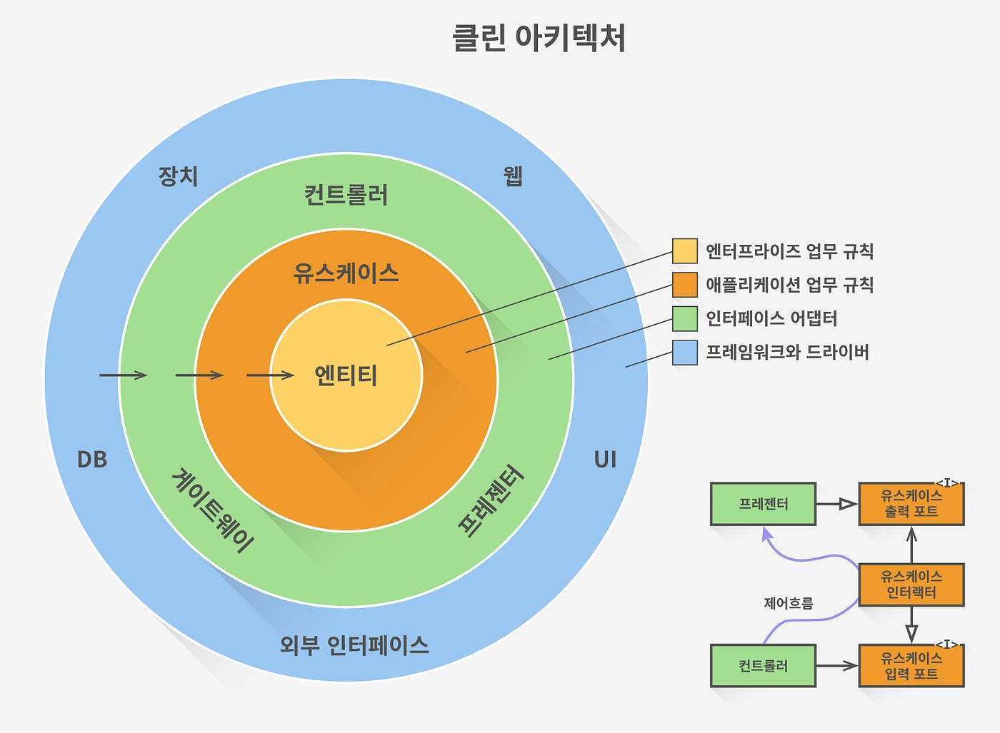

## 클린 아키텍처

---------------------

* 우리애플리케이션의 아키텍처에도 유행이 있다.
* 클린 아키텍처를 알아보고 유저 서비스의 구조를 개선해 본다.

### 클린 아키텍처

* 클린 아키텍처는 로버스마틴이 제안한 아키텍처 이다.
* 새로운 아키텍처가 아닌 양파(onion)아키텍처 에서 발전하것이다
* 소프트웨어는 여러 동심원 레이어로 나뉘고 각 레이어에 있는 컴포넌트는 안쪽 원에 있는 컴포넌트에만 의존성을 가진다.
* 따라서 안쪽 원에 존재하는 컴포넌트 바깥에 독립적이다.
* 클린아키첵처를 4개의 레이어로 분류할수 있다.
* 가장 바깥쪽은 인프라스트럭처, 인터페이스, 애플리케이션, 도메인
1. 인프라스트럭처(infrastructure)레이어
   * 우리가 만드는 애플리케이션에 필요는 하지만 외부에서 가져다 쓰는 컴포넌트들을 작성한다.
   * 예를 들어 데이터베이스, 이메일 전송, 다른 서비스와의 통신 프로토콜 등 외부에서 제공하는 인터페이스나 라이브러리를 이용하여 서비스에 맞게 구현한 구현체
2. 인터페이스(interface)레이어
   * 서비스가 제공하는 인터페이스가 구현되는 레이어
   * 컨트롤러는 외부에서 들어오는 요청은 어떤 형식이어야 하고 나가는 데이터는 어떤지 제공한다
   * 게이트웨이나 프레젠터 같은 컴포넌트도 외부와의 인터페이스를 담당하고있다.
3. 애플리케이(application)레이어
    * 애플리케이션의 비즈니스 로직이 구현되는 레이어
    * 서비스들이 여기에 존재
    * 회원가입, 이메일 인증, 회원정보, 조회 등의 로직
4. 도메인(domain)레이어
   * 애플리케이션의 핵심 도메인을 구현하는 레이어
   * 도메인 레이어는 다른 레이어에 의존하지 않는다.
   * 애플리케이션이 가여야 하는 핵심 요소만 가짐
   * 도메인 레이어의 컴포넌트가 변경된다면 이를 이용하는 다른 모든 레이어를 수정해야하므로 신중하게 작성해야 한다.



* 클린 아키텍처를 작성하기 위한 또 다른 필수 요소는 DIP 이다.
* 각 레이어의 의존성은 안쪽원을 향하는데 구현을 하기위해서는 안쪽원에서 바깥쪽 원의 구현체가 필요한 경우가 있다.
* 구현체가 변경될 경우 함께 수정해야 하므로 독립적이지 않게 된다.
* 특히 인프라 레이어는 DB 를 MySQL 로 사용하다가 PostgreSQL 로 변경하는등 바뀌는 경우가 있다.
* 이렇게 의존성이 역전되는 경우 안쪽  레이어에서 그 레이어내에 인터페이스를 정의하고 인터페이스를 구현한 구현체는 바깥 레이어에 둠으로 의존성이 역전되지 않도록 한다.

### SOLID 객체 지향 설계 원칙

* 클린 아키텍처의 바탕에는 SOLID 라 불리는 객체 지향 설계 원칙이 있다.
* SOLID 는 로버트 마틴이 객체지향 언어로 소프트웨어를 설계할때 방법론을 체계적으로 정리한것이다.
* SOLID 를 적용하면 유지보수와 확장이 쉬운 시스템을 만들수 있다.
* 더불어 읽고 이해하기 쉬운 코드를 작성하도록 가이드 해준다.
* SOLID 의 각 개념이 서로 분리되어 있는것이 아니라 함께 조합 되어 작동해야 더 나은 소프트 웨어 구조를 갖출수 있다.
1. SRP: 단일 책임 원칙: single responsibility principle
* 한 클래스는 하나의 책임만 가져야 한다.
   * 클래스를 변경해야 하는 이유는 오직 한가지 뿐이어야 한다.
   * 여기서 클래스는 언어에서 말하는 클래스 그 자체를 의미하는것이 아닌 함수, 객체등 최소 동작 단위의 개념이다.
   * 코드를 작성하다 보면 어느새 한클래스가 비대해지는데 클래스를 크기가 작고 적은 책임을 가지도록 작성해야 변경에 유연하게 대처할수 있다.
   * 커다란 클래스는 다른 클래스와 의존성이 증가하게 되므로 변경 비용이 더 커진다.
2. OCP: 개방-폐쇠 원칙: open-close principle
* 소프트웨어 요소는 확장에는 열려있으나 변경에는 닫혀있어야 한다.
  * 소프트웨어의 요구상항이 추가되었다고 해서 기존의 소스코드를 계속 고쳐야 한다면 요구사항이 늘어날수록 유지보수가 힘들다.
  * 즉 기능의 추가가 기존 코드에 영향을 끼치지 않도록 하는 구조가 필요하다.
  * OCP 는 인터페이스를 활용하여 쉽게 당성할수 있다.
  * 필요한 기능이 있다면 그 구현체에 의존하지 말고 인터페이스에 의존하도록 해야한다.
  * 추가로 필요한 기능이 있다면 인터페이스를 추가하면 된다.
3. LSP: 리스코프 치환 원칙: liskov substitution principle
* 프로그램 객체는 프로그램의 정확성을 깨뜨리지 않으면서 하위 타입의 인스턴스로 바꿀수 있어야 한다.
  * 객체지향 언어가 가지는 강점은 LSP 로 발현된다.
  * 상속관계에서 자식 클래스의 인스턴스는 부모 클래스로 선언된 함수의 인수로 전달할수 있다.
  * 이는 클래스뿐 아니라 인터페이스를 구현한 클래스에도 해당된다.
  * 실제 동작하는 인스턴스는 인터페이스가 제공하는 기능을 구현한 객체이지만 인터페이스를 사용하는 다른 객체에도 전달할수 있다.
  * 실제 구현체인 자식 인스턴스는 언제든지 부모 또는 인터페이스가 제공해야 하는 기능을 제공하는 다른 구현체로 바꿀수 있다.
4. ISP: 인터페이스 분리 원칙: intergace segregation principle
* 특정 클라이언트를 위한 인터페이스 여러개가 범용 인터페이스 하나보다 낫다
  * 하나의 인터페이스에 의존하게 되면 인터페이스에 기능이 추가 될때 인터페이스를 구현하는 모든 클래스를 수정해야 한다.
  * 인터페이스를 기능별로 잘게 쪼개어 특정 클라이언트용 인터페이스로 모아 사용하는것이 변경에 대해 의존성을 낮추고 유연하게 대처할수 있는 방법이다
5. DIP: 의존관계 역전 원칙: dependency inversion principle
* 프로그래머는 추상화에 의존해야지 구체화에 의존하면 안된다.
  * DI 와 매우 밀접한 관계를 가지고 있다.
  * 클린 아키텍처를 구현하기 위해서는 의존관계 역전이 발생하기 마련이고 이를 해소하기 위해 DI 를 이용해야 한다.
  * DI 는 보통 프레임워크에서 제공하며 혹은 DI 를 구현할수 있는 라이브러리를 이용한다.

* SOLID 를 어느정도 구현하고 역활을 분리 할지는 정해진것은 아니다.
* 시스템 발전에 따라 영향도는 낮추고 응집도는 높이는 방향으로 끊임없이 리팩터링해서 달성해야 한다.
* 코드에서 불쾌한 냄새(code smell)이 난다면 언제든지 리팩터링할 준비를 해야한다.

### 유저 서비스에 클린 아키텍처 적용하기

* 유저 서비스를 아래처럼 구성한다
```
src/users
|──application
|──common
|──domain
|──infra
|──interface
|──....
```
* 가장 안쪽 레이어인 domain 레이어에는 도메인 객체와 그 도메인 객체의 상태변화에 따라 발생되는 이벤트가 존재한다.
* UsersModule 이 가지고 있는 도메인 객체는 User 하나 밖에 없다 DDD 를 적용한다면 User 가 유저 도메인의 핵심 애그리깃이 된다.
```
export class User {
  constructor(
    private id: string,
    private name: string,
    private email: string,
    private password: string,
    private signupVerifyToken: string,
  ) { }
}
```
* User 객체가 생성할때 유저가 생성되었음을 알리는 UsercreatedEvent 를 발송해야 한다.
* 이 도메인 이벤트를 발송하는 주체는 User 의 생성자가 되는게 적당하다
* 하지만 User 클래스는 new 키워드로 생성해야 하는데 EventBus 를 주입받을수가 없다.
* 그래서 User 를 생성하는 팩터리 클래스인 UserFactory 를 이용하고 프로바이더로 제공한다.
```
@Injectable()
export class UserFactory {
  constructor(private eventBus: EventBus) { } // 1

  create( // 2
    id: string,
    name: string,
    email: string,
    signupVerifyToken: string,
    password: string,
  ): User {
    // 3
    const user = new User(id, name, email, password, signupVerifyToken);
    this.eventBus.publish(new UserCreatedEvent(email, signupVerifyToken));
    return user;
  }
}
```
1. EventBus 를 주입한다.
2. 유저 객체를 생성하는 create 함수를 제공한다.
3. 유저 객체를 생성하고 UserCreatedEvent 를 발행한다. 생성한 유저 도메인 객체를 리턴한다.
* UserCreatedEvent 는 도메인 로직과 밀접한 관계가 있기 때문에 domain 디렉터리로 이동한다.
```
src/users/domain
│──cqrs-event.ts
│──user-created.event.ts
│──user.factory.ts
└──user.ts
```
* 다음 비즈니스 로직이 구현되는 application 레이어를 만든다
* UserCreatedEvent 를 처리하는 UserEventsHandler 를 리팩터링 한다.
```
@EventsHandler(UserCreatedEvent)
export class UserEventsHandler implements IEventHandler<UserCreatedEvent> {
  constructor(
    @Inject('EmailService') private emailService: IEmailService,
  ) { }

  async handle(event: UserCreatedEvent) {
    switch (event.name) {
      case UserCreatedEvent.name: {
        console.log('UserCreatedEvent!');
        const { email, signupVerifyToken } = event as UserCreatedEvent;
        await this.emailService.sendMemberJoinVerification(email, signupVerifyToken);
        break;
      }
      default:
        break;
    }
  }
}
```
* 커맨드 핸들러도 application 레이어에 존재하는것이 좋다.
* 커맨드와 이벤트 소스들을 따로 관리하고 싶다면 디렉터리를 별도로 만드는것도 좋다.
* 커맨드 핸들러를 모두 이동했다면 쿼리 로직도 application 레이어에서 수행다는것이 좋다.
```
src/users/application
│──command
│ │──create-user.command.ts
│ │──create-uesr.handler.ts
│ │──login.command.ts
│ │──loin.handler.ts
│ │──verify-access-token.command.ts
│ │──verify-access-token.handler.ts
│ │──verify-email.command.ts
│ └──verify-email.handler.ts
│──event
│  └──user-events.handler.ts
└──query
   │──get-user-info.handler.ts
   └──get-user-info-query.ts
```
* interface 레이어를 작성해본다
* UserController 와 관계된 소스코드가 대상이다.
* UserController, UserInfo 및 DTO 관련 클래스들을 모두 interface 디렉터리로 이동한다.
```
src/users/interface
│──UserInfo
│──dto
│ │──create-user.dto.ts
│ │──user-login.dto.ts
│ └──cerify-email.dto.ts
└──user.controller.ts
```
* 가장 바깥쪽에 있는 infra 레이어는 유저 모듈에서 가져다 쓰는 외부의 컴포넌트가 포함되도록 해야한다.
* 데이터베이스와 이메일 관련로직이 그 대상이다.
* UserEntity 는 infra 레이어에 존재하지만 모두 application 레이어에 있는 핸들러가 사용하고 있다.
* 의존성이 방향이 반대로 되어 있다.
* DIP 를 적용하여 의존관계를 바로 잡는다.
* 데이터베이스에 유저 정보를 다루는 인터페이스인 IUserRepository 를 선언한다.
* IRepository 는 현재 application 레이어의 핸들러에서만 필요하지만 어느 레이어에서든 데이터를 다룰 경우가 생길수 있기 때문에 domain 레이어에 작성한다.
```
export interface IUserRepository {
  findByEmail: (email: string) => Promise<User>;
  findByEmailAndPassword: (email: string, password: string) => Promise<User>;
  findBySignupVerifyToken: (signupVerifyToken: string) => Promise<User>;
  save: (id: string, name: string, email: string, password: string, signupVerifyToken: string) => Promise<void>;
}
```
* UserRepository 클래스는 infra 레이어에 구현한다.
```
@Injectable()
export class UserRepository implements IUserRepository {
  constructor(
    private connection: Connection,
    @InjectRepository(UserEntity) private userRepository: Repository<UserEntity>,
    private userFactory: UserFactory,
  ) { }
   
   // 1
  async findByEmail(email: string): Promise<User | null> {
    const userEntity = await this.userRepository.findOne({
      where: { email }
    });
    if (!userEntity) {
      return null;
    }

    const { id, name, signupVerifyToken, password } = userEntity;

    return this.userFactory.reconstitute(id, name, email, signupVerifyToken, password); // 2
  }

  async findByEmailAndPassword(email: string, password: string): Promise<User | null> {
    const userEntity = await this.userRepository.findOne({
      where: { email, password }
    });
    if (!userEntity) {
      return null;
    }

    const { id, name, signupVerifyToken } = userEntity;

    return this.userFactory.reconstitute(id, name, email, signupVerifyToken, password);
  }

  async findBySignupVerifyToken(signupVerifyToken: string): Promise<User | null> {
    const userEntity = await this.userRepository.findOne({
      where: { signupVerifyToken }
    });
    if (!userEntity) {
      return null;
    }

    const { id, name, email, password } = userEntity;

    return this.userFactory.reconstitute(id, name, email, signupVerifyToken, password);
  }
   // 3
  async save(id: string, name: string, email: string, password: string, signupVerifyToken: string): Promise<void> {
    await this.connection.transaction(async manager => {
      const user = new UserEntity();
      user.id = id;
      user.name = name;
      user.email = email;
      user.password = password;
      user.signupVerifyToken = signupVerifyToken;

      await manager.save(user);
    });
  }
}
```
1. 인수로 전달된 이메일 주소를 가진 유저를 DB 에서 조회한다. 만약 저장되어 있지 않다면 null 을 리턴하고 존재한다면 User 도메인 객체를 돌려준다.
2. UserFactory의 create 함수 로직 내에는 UserCreateEvent 를 발행하는 로직이 포함되어 있어 재사용할수 없다. 따라서 유저 도메인 객체를 생성하는 reconstitute 함수를 사용한다.
3. CreateUserHandler 에 구현되어 있던 저장 로직을 이관한다. 유저 도메인 객체에 사용할 id가 필요하기 때문에 인수에 id 를 추가하고 외부에서 전달받도록 한다.
* CreateUserHandelr 에 적용해보기
```
@Injectable()
@CommandHandler(CreateUserCommand)
export class CreateUserHandler implements ICommandHandler<CreateUserCommand> {
  constructor(
    private userFactory: UserFactory,
    @Inject('UserRepository') private userRepository: IUserRepository, // 1
  ) { }

  async execute(command: CreateUserCommand) {
    const { name, email, password } = command;

    const user = await this.userRepository.findByEmail(email); // 2
    if (user !== null) {
      throw new UnprocessableEntityException('해당 이메일로는 가입할 수 없습니다.');
    }

    const id = ulid();
    const signupVerifyToken = uuid.v1();

    await this.userRepository.save(id, name, email, password, signupVerifyToken);

    this.userFactory.create(id, name, email, signupVerifyToken, password);
  }
}
```
1. IUserRepository 는 클래스가 아니기 때문에 의존성클래스로 주입받을수 없다 따라서 @Inject 데커레이터와 UserRepository 토큰을 이용하여 주입받는다.
2. IUserRepository 가 제공하는 인터페이스를 이용하여 데이터를 조회하고 저장한다.
```
onst commandHandlers = [
  CreateUserHandler,
  VerifyEmailHandler,
  LoginHandler,
  VerifyAccessTokenHandler,
];

const queryHandlers = [
  GetUserInfoQueryHandler,
];

const eventHandlers = [
  UserEventsHandler,
];

const factories = [
  UserFactory,
];

const repositories = [
  { provide: 'UserRepository', useClass: UserRepository }, // 1
  { provide: 'EmailService', useClass: EmailService },
];

@Module({
  imports: [
    EmailModule,
    TypeOrmModule.forFeature([UserEntity]),
    AuthModule,
    CqrsModule,
  ],
  controllers: [UsersController],
  providers: [
    Logger,
    ...commandHandlers,
    ...queryHandlers,
    ...eventHandlers,
    ...factories,
    ...repositories,
  ],
})
export class UsersModule { }
```
1. UserRepository 프로바이더는 커스텀 프로바이더에서 배웠던 방식으로 주입한다.
* 이메일 모듈이 유저 모듈과 강하게 결합되어 있는것을 인터페이스로 느슨하게 연결해본다.
* 이메일 모듈은 유저 모듈의 입장에서는 외부시스템이기 때문에 infra 에 구현체가 존재햐아 한다.
* 그러나 UserEventsHandler 에서 사용하기 때문에 application 레이어에 존재해야한다.
* 따라서 application  레이어에 IEmailService 를 정의한다.
```
export interface IEmailService {
  sendMemberJoinVerification: (email, signupVerifyToken) => Promise<void>;
}

import { Injectable } from '@nestjs/common';
import { EmailService as ExternalEmailService } from 'src/email/email.service'; // 1
import { IEmailService } from 'src/users/application/adapter/iemail.service';
@Injectable()
export class EmailService implements IEmailService {
  constructor(
    private emailService: ExternalEmailService, // 2
  ) { }

  async sendMemberJoinVerification(email: string, signupVerifyToken: string): Promise<void> {
    this.emailService.sendMemberJoinVerification(email, signupVerifyToken);
  }
}
```
1. EmailModule 에 존재하는 EmailService 를 ExternalEmailService 타입으로 이름을 바꾸어 가져온다.
2. EmailModule 이 UserModule 과 같은 서비스에 존재하기 때문에 직접 주입받을수 있지만 MSA 를 적용하여 별개의 서비스로 분리했다면 HTTP 등 다른 프로토콜을 이용하여 호출할 것이다.
* UserEvenetsHandler 에서 IEmailService 를 주입받아 사용한다.
```
@EventsHandler(UserCreatedEvent)
export class UserEventsHandler implements IEventHandler<UserCreatedEvent> {
  constructor(
    @Inject('EmailService') private emailService: IEmailService,
  ) { }

  async handle(event: UserCreatedEvent) {
    switch (event.name) {
      case UserCreatedEvent.name: {
        console.log('UserCreatedEvent!');
        const { email, signupVerifyToken } = event as UserCreatedEvent;
        await this.emailService.sendMemberJoinVerification(email, signupVerifyToken);
        break;
      }
      default:
        break;
    }
  }
}
```
* IUserRepository 와 마찬가지로 IEmailService 를 커스텀 프로바이더로 제공해야 한다.
* 최종 작업 결과 소스코드 트리
```
src/users/
│──application
│  │──adapter
│  │  └──iemail.service.ts
│  │──command
│  │  │──create-user.command.ts
│  │  │──create-uesr.handler.ts
│  │  │──login.command.ts
│  │  │──loin.handler.ts
│  │  │──verify-access-token.command.ts
│  │  │──verify-access-token.handler.ts
│  │  │──verify-email.command.ts
│  │  └──verify-email.handler.ts
│  │──event
│  │  └──user-events.handler.ts
│  └──query
│     │──get-user-info.handler.ts
│     └──get-user-info.query.ts
│──domain
│  │──cqrs-event.ts
│  │──repository
│  │  └──iuser.repositry.ts
│  │──user-created.event.ts
│  │──user.factory.ts
│  └──user.ts
│──infra
│  │──adapter
│  │  └──email.service.ts
│  └──db
│     │──entity
│     │  └──user.entity.ts
│     └──repository
│        └──UserRepositry.ts
│──interface
│  │──UserInfo.ts
│  │──dto
│  │  │──create-user.dto.ts
│  │  │──user-login.dto.ts
│  │  └──verify-email.dto.ts
│  └──users.controller.ts
└──users.module.ts
```
