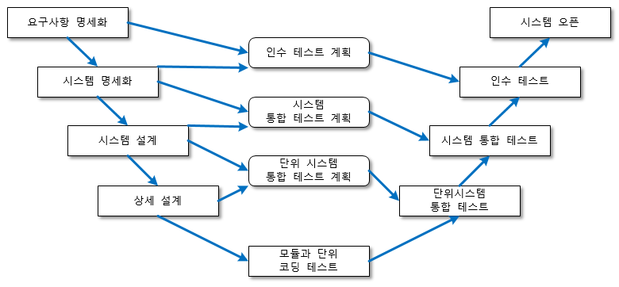

## 테스트 자동화

------------------

### 소프트웨어 테스트

* 모든 제품은 릴리스 전에 테스트를 통과해야한다.
* 일반적인 QA(quality assurance)라 불리는 테스트 작업을 수행한다.
* 소프트웨어 테스팅은 버그가 없다고 확신하는게 아니라 소프트웨어의 품질이 사용자에게 전달될 정도의 수준이 되었다는것을 보증하는 과정이다.
* 소프트웨어 개발 프로세스에서의 테스트는 분류방법에 따라 그 종류가 다양하다.
* 먼저 개발단계에 다른 V 모델을 사용한다.
* 보통 업무의 진행은 좌상단 요구사항 분석에서 시작해서 시스템설계, 아키텍처 설계, 모듈설계, 코딩으로 진행된다.
* 테스트는 각단계와 대응되는 테스트 과정을 역순으로 수행한다.
* 이 개발 방법론이 폭포수 모델로서 현대 개발 방법에 들어 맞지 않는다고 생각할수 있겠지만 이과정을 소수의 백로그로 이터레이션 마다 애자일 하게 수행한다고 생각하면 된다.



|               개발단계(↓)                |            테스트 종류(↑)             |                                                                                                                                                                                               내용                                                                                                                                                                                                |
|:------------------------------------:|:--------------------------------:|:-----------------------------------------------------------------------------------------------------------------------------------------------------------------------------------------------------------------------------------------------------------------------------------------------------------------------------------------------------------------------------------------------:|
| 요구 사항 분석<br/>(requirements analysis) | 인수 테스트<br/>(acceptance testing)  |                                                                                                                                                        알파, 베타테스트와 깉이 실사용 환경에서 문제를 확인한다. 이 테스트의 목적은 시스템을 운영환경에 배포할 준비가 되었는지를 확인하는것이 목적이다.                                                                                                                                                        |
|      시스템 설계<br/>(system design)      |   시스템 테스트<br/>(system testing)   | 소프트 웨어가 구동되는 환경의 제약 사항으로 인해 발생하는 문제를 찾기 위한 테스트이다.<br/>* 회복테스트(recovery test): 정전등과 같은 유사 상황 발생시 자동 초기화, 데이터 회복이 제대로 되는지 확인<br/>* 보안테스트(security test): 해킹공격에 안전한지 확인.<br/>* 강도테스트(stresss test): 급격한 트래픽 증가와 같이 큰부하에 대해 안전한지 확인.<br/>* 민감도 테스트(sensitivity test): 잘못된 데이터  타입을 가지는 데이터를 입력으로 넣거나 경곗값이 제대로 동작하는지 확인.<br/>* 성능 테스트(performance test): 응답시간, 응답 처리량등 시스템의 자원이 효율적으로 사용되고 있는지 확인한다. |
|  아키텍처 설계<br/>(architecture design)   | 통합 테스트<br/>(integration testing) |                                                                                                                               각 모듈이 제대로 작성되었다면 이제 여러 모듈이 함께 동작했을때 문제가 없는지 검증하는 과정<br/>상향식, 하향식, 백본 통합 등의 방식이 있다.<br/>코드 레벨에서 코드를 파악하지 않고 수행하기 때문에 블랙박스 테스트라고 한다.                                                                                                                                |
|       모듈설계<br/>(module design)       |    단위 테스트<br/>(unit testing)     |                                          테스트 과정에서 가장 먼저 수행되는 테스트. 소프트웨어의 코드가 제대로 동작하는지 저수준에서 테스트 코드를 작성하여 검증한다.<br/>따라서 코드를 제대로 파악하고 있는 개발자 자신이 테스트 코드를 작성하는것이 대부분 이지만 테스트 엔지니어가 테스트 코드를 작성하기도 한다.<br/>테스트 엔지니어가 코드 작성 능력이 있고 가용자원이 있다면 테스트 엔지니어가 작성하는것이 좋은데 테스트 엔지니어의 전문성을 살려 개발자가 예상하지 못했던 테스트 케이스를 만들수 있기 때문이다. 개발자와 테스트 엔지니어가 함께 작성하는 것도 좋은 방법이다.                                           |
|           코딩<br/>(coding)            |       디버깅<br/>(debugging)        |                                                                                                                                                              개발자가 직접 코드의 로직을 검증하고 오류를 디버깅 하는 과정이다. 이는 테스트 과정이라고는 할수 없고 개발 과정으로 본다.                                                                                                                                                              |

* 테스트를 프로그램의 실행 여부에 따라 정적 테스트와 동적 테스트로 나눌수 있다.
* 정적테스트는 코드를 수행하지 않고 검증하는 테스트이다. 정적 분석기를 이용하여 코드에 내재된 이슈를 미리 파악해볼수 있고, 코드 리뷰를 받는것도 정적 테스트의 일종이다.
* 동적테스트는 직접 프로그램을 실행해 보며 진행 하는 테스트이다.
* 테스트 주도 개발(test-driven development)를 활용하여 테스트 코드를 먼저 작성하고 이를 기반으로 실제 소프트웨어의 코드를 작성해 나가는 방법론도 있다.
* 테스트 코드는 단위 테스트 코드만을 의미하진 않는다.
* E2E(end-to-end)테스트는 사용자의 행동을 코드로 작성한 것이다.
* 사용자의 어떤 동작이 일어나는지 부터 시작해서 모든 시스템을 동적으로 수행한후 응답을 확인하는 방식이다.
* 테스트 코드가 잘 준비 되었다면 더 나아가 배포 과정에 포함하도록 하여야 한다.
* 지속적 통함(continous integration)및 지속적 배포(conticous deployment)과정에 포함된 자동화 테스트는 통합/배포 과정에서 소스코드 저장소에 버그가 스며드는 것을 방지해준다.

### Nest 기본 테스트 프레임 워크: Jest, superTest

* 자바스크립트에는 많은 테스트 프레임워크가 존재한다.
* 테스트 프레임워크 구성요소로서 테스트가 실행되는 환경을 제공하는 테스트러너, 테스트의 상황을 가정하는 어서션(assertion), 테스트 기대 결과를 비교하는 매처(matcher), 테스트 과정에서 현재 테스트 대상 모듈이 의존하는 다른 모듈을 임의것으로 대체하는 테스트 더블등이 있다.
* Jest 는 메타가 주도해서 만든 테스트 프레임워크다.
* 문법이 심플하고 Nest, Babel, 타입스크립트, Node.js, 리액트, 앵귤러, vue.js 에 적용하여 사용할수 있다.
* SuperTest 는 superagent 라이브러리를 기반으로 하는 HTTP 테스트 라이브러리 이다.
* SuperTest 를 이용하면 컨트롤러가 제공하는 엔드포인트로 호출하는것과 같은 E2E 테스트를 작성할수 있다.

### Jest 를 이용한 단위테스트

* Nest cLI 를 이용하여 프로젝트를 생성하면 기본 컴포넌트와 함께 해당 컴포넌트에 대한 테스트 파일이 생성된다.
* 자동 생성된 테스트 코드는 Jest 를 이용한다.
* 테스트 코드의 파일명은 .spec.ts 로 끝나야 한다.
* 이 규칙은 package.json 에 정의되어 있다.
```
{
  .....
  "jest": {
    "moduleFileExtensions": [
      "js",
      "json",
      "ts"
    ],
    "rootDir": "src",
    "testRegex": ".*\\.spec\\.ts$", // 1
    "transform": {
      "^.+\\.(t|j)s$": "ts-jest"
    },
    "collectCoverageFrom": [
      "**/*.(t|j)s"
    ],
    "coverageDirectory": "../coverage",
    "testEnvironment": "node"
  }
}
```
1. 테스트 코드 파일의 확장자 형식을 정규표현식으로 선언
* 테스트 코드는 describe() 와 it() 구문으로 구성된다.
* describe() 는 테스트 스위트를 작성하는 블록이다.
* 테스트 스위트는 테스트를 의미있는 단위로 묶은것이다.
* 테스트 스위트를 묶어 더 큰 단위의 테스트 스위트를 만들수 있다.
* 테스트 스위트는 테스트 수행에 필요한 환경 설정, 공통 모듈 생성등과 같이 세부 테스트 케이스가 수행하기 위한 기반을 마련한다.
* it() 구문은 특정 테스트 시나리오를 작성하는 부분이다.
* it() 구문은 별개의 테스트 케이스로 다뤄져야 하며 서로 의존관계가 존재하지 않도록 작성하는것이 중요하다.
* 테스트 케이스의 작성법도 TDD 스타일로 하느냐 BDD(behavior-driven development)스타일을 따라야 하느냐 논쟁이 있지만 둘다 필요한 방식이다.
* Given/When/Then 의 BDD 스타일로 테스트 코드를 작성해 본다.
  * Given: 해당 테스트 케이스가 동작하기 위해 갖춰져야 하는 선행 조건이다. 즉 어떤 상황이 주어졌을때를 뜻한다.
  * When: 테스트 하고자 하는 대상 코드를 실행한다. 대상 코드가 동작한다면을 뜻한다.
  * Then: 대상 코드의 수행 결과를 판단한다. 기대한 값과 수행결과가 맞는지 비교한다.
* describe() 와 : 구분은 첫번째 인수로 문자열을 받는다. 이는 테스트 스위트와 테스트 케이스의 이름을 의미한다.
* 두번째 인수는 수행될 코드가 포함된 콜백함수 이다.
```
describe('UserService', () => {
    const userService:UsersService = new UsersService();
    
    describe('create', () => {
        it('should create user', () => {
            // Given
            ....
            // When
            ....
            // Then
        });

        it('should throw error when user already exist', () => {
            // Given
            ....
            // When
            ....
            // Then
        });
    });
});
```
* describe() 와 it() 구문 외에 SetUp, TearDown 이라 부르는 개념도 있다.
* 테스트 스위트 내에서 모든 테스트 케이스를 수행하기 전에 수행해야 하는 선행조건이 있다면 SetUp 구문으로 반복작업을 줄일수 있다
* 마찬가지로 테스트후 후처리가 필요하다면 TearDown 에서 공통 처리 한다.
* Jest 는 beforeAll(), beforeEach(), afterAll(), afterEach() 4가지의 구문을 제공한다.
* beforeAll() 는 테스트 스위트 내의 모든 테스트 케이스 수행전 한번만 실행된다.
* beforeEach() 는 각 테스트 케이스가 수행되기 전마다 수행된다.
* afterEach() 는 모든테스트 케이스가 수행된후 마다 수행된다.
* afterAll() 는 모든 ㅔ스트 케이스가 수행된후에 한번만 실행된다.
* 테스트를 하고자 하는 대상의 동작에만 집중하고 대상 코드가 수행되면서 주입받거나 생성해서 사용한 외부 모듈이나 객체는 테스트의 대상이 아니다.
* 외부 모듈은 외부 모듈만을 위한 테스트 코드를 작성해야 한다.
* 외부 모듈을 임의의 객체로 다루는것 이개념을 테스트 더블(test double)이라고 한다.
* 테스트 더블을 세부적으로 더비(dummy), 페이크(fake), 스텁(stub), 스파이(spy), 모의객체(mock)으로  나눈다.
  * 더미: 테스트를 위해 생성된 가짜 데이터. 일반적으로 매개변수 목록을  채우는 데만 사용된다.
  * 페이크: 데이터 베이스로 관리되는 다량의 데이터를 테스트 한다고 할때 실제 DB 를 사용하면 I/O 에 엄청난 시간과비용이 소요되므로 인메모리 DB 와 같이 메모리에 데이터 베이스를 적재해서 속도를 개선할수 있다. 프로덕션 환경에서는 테스트 수행 도중 시스템이 비정상 종료되는경우 잘못된 데이터가 남게 되므로 잘못된 데이터가 남아도 상관없는 세션등과 같은것을 대상으로 테스트할때 사용한다.
  * 스텁: 함수 호출 결과를 미리 준비된 응답으로 제공한다.
  * 모의 객체: 스텁과 비슷한 역활. 테스트 중에 만들어진 호출에 미리 준비된 답변을 제공하며 일반적으로 테스트를 위해 프로그래밍된 것 외엔 응답하지 않는다.
* 마틴파울러에 따르면 테스트 대상이 의존하는 대상의 행위에 대해 검증이 필요하다면 모의 객체를 사용하고 상태를 검증하고자 한다면 스텁을 사용하라고 한다.

### 유저 서비스 테스트

* 가장 안쪽 레이어에 존재하는 도메인 객체에 대한 테스트 부터 작성한다.
* 생성자와 게터밖에 존재하지 않는 클래스에 대해서는 테스트케이스를 작성할 필요는 없다.
* 사내에서 테스트커버리지 몇퍼센트 이상이어야 한다는 규칙이 있다면 작성할수도 있지만 그럴경우 커버리지 계산에서 제외해서 불필요한 테스트를 작성하는 수고를 줄여야 한다.
* UserFactory 에 대한 테스트를 작성한다.
* 테스트 케이스의 내용을 채우기 위해서 테스트 대상인 UserFactory 객체가 필요하다.
* @nest/testing 패키지에서 제공하는 Test 클래스를 사용하여 테스트용 객체를 생성할수 있다.
```
import { Test } from '@nestjs/testing';
import { EventBus } from '@nestjs/cqrs';
import { UserFactory } from './user.factory';
import { User } from './user';

describe('UserFactory', () => {
  let userFactory: UserFactory; // 1

  beforeAll(async () => { // 2 // 3
    const module = await Test.createTestingModule({
      providers: [
        UserFactory,
      ],
    }).compile(); // 4

    userFactory = module.get(UserFactory);
  });

  describe('create', () => {
    it('should create user', () => {
      // Given

      // When
      const user = userFactory.create(
        'user-id',
        'Dexter',
        'dexter.haan@gmail.com',
        'signup-verify-token',
        'pass1234',
      );

      // Then
      const expected = new User(
        'user-id',
        'Dexter',
        'dexter.haan@gmail.com',
        'pass1234',
        'signup-verify-token',
      );
      expect(expected).toEqual(user);

      expect(eventBus.publish).toBeCalledTimes(1);
    });
  });

});
```
1. 테스트 스위트 전체에서 사용할 UserFactory 를 선언한다.
2. Test.createTestingModule() 함수를 사용하여 테스트 모듈을 생성한다. 이함수의 인수가 Modulemetadata 이므로 모듈을 임포트 할때와 동일하게 컴포넌트를 가져올수 있다. UserFactory 가 대상 클래스 이므로 이 모듈을 프로바이더로 가져온다.
3. 모듈을 가져오는것은 전체 테스트 스위트 내에서 한번만 이루어지면 되므로 설정 단계인 beforeAll() 구문내에서 수행한다.
4. Test.crreateTestingModule  함수의 리턴값은 TestingModuleBuilder 이다. compile 함수를 수행해서 모듈 생성을 완료한다. 이 함수는 비동기로 처리된다.
```
@Injectable()
export class UserFactory {
  constructor(private eventBus: EventBus) { }

  create(
    id: string,
    name: string,
    email: string,
    signupVerifyToken: string,
    password: string,
  ): User {
    const user = new User(id, name, email, password, signupVerifyToken);

    this.eventBus.publish(new UserCreatedEvent(email, signupVerifyToken));

    return user;
  }
}
```
* 유저 도메인 객체를 생성하는 과정에서 UserCreatedEvent 를 발행하고 있다.
* 이동작은 UserFactory 를 테스트 하는데 영향을 끼쳐서는 안되는 동작이다.
* 따라서 이벤트 버스를 통해 제대로 전송이 되었다고 가정하고 테스트를 작성해야 하고, 이벤트 발송 함수인 publish 가 호출이 되었는지를 spy 를 통해 판별하면 된다.
* EventBus 객체 테스트를 위한 모의객체 선언
```
describe('UserFactory', () => {
  ....
  let eventBus: jest.Mocked<EventBus>; // 1

  beforeAll(async () => {
    const module = await Test.createTestingModule({
      providers: [
        UserFactory,
        { // 2
          provide: EventBus,
          useValue: {
            publish: jest.fn(),
          }
        }
      ],
    }).compile();

    userFactory = module.get(UserFactory);
    eventBus = module.get(EventBus); // 3
  });
}
```
1. EventBus 를 Jest 에서 제공하는 Mocked 객체로 선언한다.
2. EventBus 를 프로바이더로 제공한다. 이떄 EventBus 의 함수를 모의 함수라고 한다. publish 함수가 jest.fn() 으로 선언되었는데 이는 어떠한 동작도 하지 않는 함수라는 뜻이다.
3. 프로바이더로 제공된 EventBus 객체를 테스트 모듈에서 가져온다.
* create 함수의 테스트 케이스를 작성한다.
```
describe('create', () => {
    it('should create user', () => {
        // Given // 1
    
        // When // 2
        const user = userFactory.create(
            'user-id',
            'Dexter',
            'dexter.haan@gmail.com',
            'signup-verify-token',
            'pass1234',
        );

        // Then // 3
        const expected = new User(
            'user-id',
            'Dexter',
            'dexter.haan@gmail.com',
            'pass1234',
            'signup-verify-token',
        );
        expect(expected).toEqual(user); // 4

        expect(eventBus.publish).toBeCalledTimes(1); // 5
    });
});
```
1. create 함수의 주어진 조건은 딱히 없기 때문에 비워둔다.
2. UserFactory 가 create 함수를 수행한다.
3. 수행결과가 원하는 결과와 맞는지 검증한다. 먼저 When 단계를 수행했을때 원하는 결과를 기술하고 Jest 에서 제공하는 매처를 이용해서 판단한다.
4. UserFactory.create 를 통해 생성한 user 객체가 원하는 객체와 맞는지 검사한다.
5. 이 과정에서 EventBus.publish 함수가 한번 호출되었는지 판단한다.
```
describe('reconstitute', () => {
    it('should reconstitute user', () => {
        // Given

        // When
        const user = userFactory.reconstitute(
            'user-id',
            'Dexter',
            'dexter.haan@gmail.com',
            'pass1234',
            'signup-verify-token',
        );

        // Then
        const expected = new User(
            'user-id',
            'Dexter',
            'dexter.haan@gmail.com',
            'signup-verify-token',
            'pass1234',
        );
        expect(expected).toEqual(user);
    });
});
```
```
> book-nestjs-backend@2.0.0 test
> jest

 PASS  src/users/domain/user.factory.spec.ts (5.865 s)
 PASS  src/users/application/command/create-user.handler.spec.ts (5.887 s)

Test Suites: 2 passed, 2 total
Tests:       4 passed, 4 total
Snapshots:   0 total
Time:        6.89 s
Ran all test suites.
```
* application 레이어의  컴포넌트를 대상으로 테스트 작성
```
import * as uuid from 'uuid';
import * as ulid from 'ulid';
import { Test } from '@nestjs/testing';
import { CreateUserHandler } from './create-user.handler';
import { UserFactory } from '../../domain/user.factory';
import { UserRepository } from 'src/users/infra/db/repository/UserRepository';
import { CreateUserCommand } from './create-user.command';
import { UnprocessableEntityException } from '@nestjs/common';

// 1
jest.mock('uuid');
jest.mock('ulid');
jest.spyOn(uuid, 'v1').mockReturnValue('0000-0000-0000-0000');
jest.spyOn(ulid, 'ulid').mockReturnValue('ulid');

describe('CreateUserHandler', () => {
  // 2
  let createUserHandler: CreateUserHandler;
  let userFactory: UserFactory;
  let userRepository: UserRepository;

  beforeAll(async () => {
    const module = await Test.createTestingModule({
      providers: [
        CreateUserHandler,
        { // 3
          provide: UserFactory,
          useValue: {
            create: jest.fn(),
          },
        },
        { // 3
          provide: 'UserRepository',
          useValue: {
            save: jest.fn(),
          },
        }
      ],
    }).compile();

    createUserHandler = module.get(CreateUserHandler);
    userFactory = module.get(UserFactory);
    userRepository = module.get('UserRepository');
  });
  // 4
  const id = ulid.ulid();
  const name = 'Dexter';
  const email = 'dexter.haan@gmail.com';
  const password = 'pass1234';
  const signupVerifyToken = uuid.v1();

  describe('execute', () => {
    it('should execute CreateUserCommand', async () => {
      // Given
      userRepository.findByEmail = jest.fn().mockResolvedValue(null); // 5

      // When
      await createUserHandler.execute(new CreateUserCommand(name, email, password));

      // Then // 6
      expect(userRepository.save).toBeCalledWith(
        id,
        name,
        email,
        password,
        signupVerifyToken,
      );
      expect(userFactory.create).toBeCalledWith(
        id,
        name,
        email,
        signupVerifyToken,
        password,
      );
    });

    it('should throw UnprocessableEntityException when user exists', async () => {
      // Given
      userRepository.findByEmail = jest.fn().mockResolvedValue({ // 7
        id,
        name,
        email,
        password,
        signupVerifyToken,
      });

      // When
      // Then // 8
      await expect(createUserHandler.execute(new CreateUserCommand(name, email, password)))
        .rejects
        .toThrowError(UnprocessableEntityException);
    });
  });
});
```
1. CreateUserHandler.execute 내에 uuid 와 ulid 라이브러리를 사용한다. 외부 라이브러리가 생성하는 임의의 문자열이 항상 같은 값('0000-0000-0000-0000','ulid')이 나오도록 한다.
2. 테스트 대상인 CreateUserHandeler 와 의존하고 있는 클래스를 선언한다.
3. UserFactory, UserRepository 를 모의 객체로 제공한다.
4. 항상 같은값을 가지는 변수를 미리 선언하고 재사용 하도록 했다.
5. 기본 테스트 케이스를 위해 userRepository 에 저장된 유저가 없는 조건을 설정한다.
6. UserFactory 테스트의 경우 테스트 대상 클래스가 의존하고 있는 객체의 함수를 단순히 호출하는지만 검증 했다면 이번에는 인수까지 제대로 넘기고 있는지 검증한다.
7. 생성하려는 유저 정보가 이미  저장되어 있는 경우를 모의한다.
8. 수행 결과 원하는 예외가 발생하는지 검증한다.

### 테스트 커러비지 측정

* `npm run test:cov`를 통하여 테스트 커버리지를 측정할수 있다.
```
> book-nestjs-backend@2.0.0 test:cov
> jest --coverage

 PASS  src/users/domain/user.factory.spec.ts (6.33 s)                                                                                                                                 
 PASS  src/users/application/command/create-user.handler.spec.ts (6.362 s)
-----------------------------------|---------|----------|---------|---------|-------------------
File                               | % Stmts | % Branch | % Funcs | % Lines | Uncovered Line #s 
-----------------------------------|---------|----------|---------|---------|-------------------
All files                          |   11.88 |     5.88 |   13.04 |    12.5 |                   
 src                               |       0 |        0 |       0 |       0 |                   
  app.module.ts                    |       0 |      100 |     100 |       0 | 1-62              
  auth.guard.ts                    |       0 |      100 |       0 |       0 | 3-22              
  main.ts                          |       0 |        0 |       0 |       0 | 1-33              
 src/auth                          |       0 |      100 |       0 |       0 |                  
  auth.module.ts                   |       0 |      100 |     100 |       0 | 1-10             
  auth.service.ts                  |       0 |      100 |       0 |       0 | 1-39             
 src/config                        |       0 |      100 |       0 |       0 |                  
  authConfig.ts                    |       0 |      100 |       0 |       0 | 1-3              
  emailConfig.ts                   |       0 |      100 |       0 |       0 | 1-3              
  validationSchema.ts              |       0 |      100 |     100 |       0 | 1-3              
 src/email                         |       0 |      100 |       0 |       0 |                  
  email.module.ts                  |       0 |      100 |     100 |       0 | 1-8              
  email.service.ts                 |       0 |      100 |       0 |       0 | 2-46             
 src/exception                     |       0 |        0 |       0 |       0 |                  
  exception.module.ts              |       0 |      100 |     100 |       0 | 1-11             
  http-exception.filter.ts         |       0 |        0 |       0 |       0 | 1-28             
 src/health-check                  |       0 |        0 |       0 |       0 |                  
  dog.health.ts                    |       0 |        0 |       0 |       0 | 1-24             
  health-check.controller.ts       |       0 |      100 |       0 |       0 | 1-19             
 src/logging                       |       0 |      100 |       0 |       0 |                  
  logging.interceptor.ts           |       0 |      100 |       0 |       0 | 1-16             
  logging.module.ts                |       0 |      100 |     100 |       0 | 1-11             
 src/migrations                    |       0 |      100 |       0 |       0 |                  
  1640444480113-CreateUserTable.ts |       0 |      100 |       0 |       0 | 3-11             
 src/users                         |       0 |      100 |     100 |       0 |                  
  users.module.ts                  |       0 |      100 |     100 |       0 | 1-60             
 src/users/application/command     |    31.5 |    33.33 |      25 |    32.3 |                  
  create-user.command.ts           |     100 |      100 |     100 |     100 |                  
  create-user.handler.ts           |     100 |      100 |     100 |     100 |                  
  login.command.ts                 |       0 |      100 |       0 |       0 | 3-6              
  login.handler.ts                 |       0 |        0 |       0 |       0 | 1-23             
  verify-access-token.command.ts   |       0 |      100 |       0 |       0 | 3-5              
  verify-access-token.handler.ts   |       0 |      100 |       0 |       0 | 1-35             
  verify-email.command.ts          |       0 |      100 |       0 |       0 | 3-5              
  verify-email.handler.ts          |       0 |        0 |       0 |       0 | 1-23             
 src/users/application/event       |       0 |        0 |       0 |       0 |                  
  user-events.handler.ts           |       0 |        0 |       0 |       0 | 1-21             
 src/users/application/query       |       0 |        0 |       0 |       0 |                  
  get-user-info.handler.ts         |       0 |        0 |       0 |       0 | 1-26             
  get-user-info.query.ts           |       0 |      100 |       0 |       0 | 3-5              
 src/users/domain                  |   89.28 |      100 |   66.66 |   88.46 |                  
  cqrs-event.ts                    |     100 |      100 |     100 |     100 |                  
  user-created.event.ts            |     100 |      100 |     100 |     100 |                  
  user.factory.ts                  |     100 |      100 |     100 |     100 |                  
  user.ts                          |   66.66 |      100 |      25 |   66.66 | 11-19            
 src/users/infra/adapter           |       0 |      100 |       0 |       0 |                  
  email.service.ts                 |       0 |      100 |       0 |       0 | 1-12             
 src/users/infra/db/entity         |       0 |      100 |     100 |       0 |                  
  user.entity.ts                   |       0 |      100 |     100 |       0 | 1-17             
 src/users/infra/db/repository     |       0 |        0 |       0 |       0 |                  
  UserRepository.ts                |       0 |        0 |       0 |       0 | 1-65             
 src/users/interface               |       0 |      100 |       0 |       0 |                  
  users.controller.ts              |       0 |      100 |       0 |       0 | 1-53             
 src/users/interface/dto           |       0 |        0 |       0 |       0 |                  
  create-user.dto.ts               |       0 |        0 |       0 |       0 | 1-25             
  user-login.dto.ts                |       0 |      100 |     100 |       0 | 1                
  verify-email.dto.ts              |       0 |      100 |     100 |       0 | 1                
 src/utils/decorators              |       0 |        0 |       0 |       0 |                  
  not-in.ts                        |       0 |        0 |       0 |       0 | 1-15             
-----------------------------------|---------|----------|---------|---------|-------------------

Test Suites: 2 passed, 2 total
Tests:       4 passed, 4 total
Snapshots:   0 total
Time:        18.499 s
Ran all test suites.
```
* 테스트 결과를 이용하여 테스트가 어느정도 애플리케이션 코드를 테스트 하고 있는지 파악할수 있다.
* 사내 테스트커버리지 기준을 정했다면 결과를 만족하지 못했을 경우 릴리스를 하지 못하도록 CI/CD 과정에 포함시킬수 있다.
* 테스트 커버리지 측정을 수행하면 프로젝트 루트 디렉터리 아래에 coverage 디렉터리가 생긴다.
* 이 디렉터리에 커버리지 측정결과가 저장되어 있으므로 HTML 리포트를 볼수 있고 각 모듈을 선택하여 라인별로 수행된 부분과 수행하지 않은 부분을 확인할수 있다.