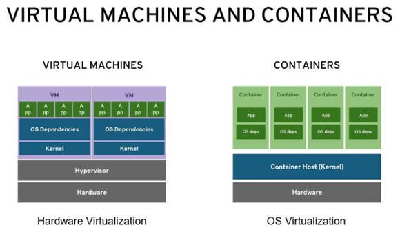
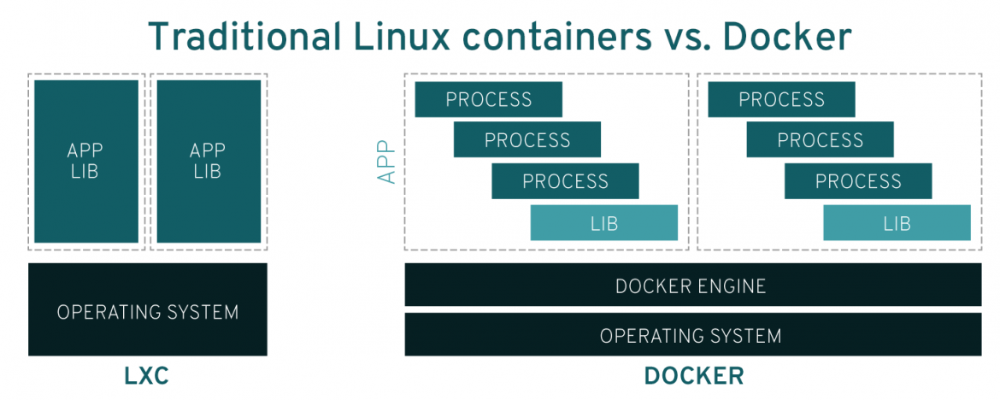

## 도커

-------------------------

### 도커란 무엇인가

* 도커는 데이터 또는 프로그램을 격리시키는 기능을 제공한다.
* 주로 서버 환경을 구축할 때 사용한다.

#### 컨터에너와 도커 엔진

* 개인용 컴퓨터 또는 서버상의 환경을 조립형 창고 같은 작은 방으로 분할하는것이 컨테이너이다.
* 컨테이너를 다루는 기능을 제공하는 소프트웨어가 도커이다.
* 도커를 사용하기 위해서는 도커엔진을 설치해야 한다.
* 컨테이너를 만드려면 이미지가 필요하다.
* 도커는 내부적으로 리눅스가 사용된다.
* 컨테이너에서 동작시킬 프로그램도 리눅스용이다.

#### 데이터 프로그램을 독립된 환경에 격리해야 하는 이유

* 프로그램 간의 공유가 이뤄지면 테스트하기 어렵고 버그가 발생하기 쉽기 떄문
* 프로그램 간의 버전을 다르게 이용할수 있기 때문

### 서버와 도커

* 서버는 어떤 서비스(service)를 제공(serve)하는것
* 개인용 컴퓨터는 개인이 사용하지만 서버는 여러 사람이 원격으로 접근해 사용한다.
* 서버의 기능은 소프트 웨어가 제공 하는것이므로 소프트웨어를 설치하면 서버의 기능을 갖게 된다.

|    서버의 종류   |                                                                         설명                                                                          |
|:--------------:|:---------------------------------------------------------------------------------------------------------------------------------------------------:|
|웹서버|              웹사이트 기능을 제공하는 서버, HTML 파일 또는 이미지 파일, 프로그램을 배치하고, 클라이언트 컴퓨터의 브라우저에서 접근해오면 이들 파일을 제공한다. 대표적인 소프트웨어로 아파치, Nginx, IIS 등이 있다.               |
|메일 서버| 메일 송수신을 담당하는 SMTP 서버와 클라이언트에 메일을 전달하는 POP 서버로 나뉜다. 이들을 합쳐 메일 서버라 한다. 메일을 내려받지 않고 서버에 둔채로 읽는 IMAP4 서버도 있다. 대표적 소프트웨어로 Sendmail, Postfix, Exim 등이 있다. |
|데이터 베이스 서버|                데이터 베이스를 관리하는 서버, 데이터 베이스 서버는 데이터 베이스를 관리하는 소프트웨어를 설치하면 된다. 대표적인 소프트웨어로 MySQL, PostgreSQL, Oracle, SQL Server 등이 있다.                 |
|파일 서버|                                        파일을 저장하는 서버, 파일 서버는 파일을 저장하는 소프트웨어를 설치하면 된다. 대표적인 소프트웨어로 Samba 등이 있다.                                        |
| DNS 서버|                                                          IP 주소와 도메인을 연결해주는 DNS 기능을 제공하는 서버                                                          |
|DHCP 서버|                                                                IP 주소를 자동으로 할당해주는 서버                                                                 |
|FTP 서버|                                       FTP 프로토콜을 사용해 파일 송수신 기능을 제공하는 서버, 웹서버와 함께 설치하는 경우가 많으며, 파일을 제공하는데 사용한다.                                       |
|프락시 서버|         통신을 중계하는 역활을 맡는 서버, 사내 로컬 네트워크등 인터넷과 격리된 장소에서 인터넷 상의 서버에 접속할때 사용한다. 프락시 서버를 경유하면 접속 대상 컴퓨터에 자신의 정체를 숨길수 있으므로 정체를 드러내고 싶지 않을때도 사용한다.         |
|인증서버| 사용자 인증을 위한 서버. 윈도우 네트워크에 로그인하기 위한 Active Directory 서버 또는 무선 LAN 이나 원격 접속에서 사용자가 인증을 맡는 Radius 서버 등이 있다. 대표적 소프트웨어로 OpenLDAP, Active Diretory 등이 있다. |

* 서버 운영체제 종류
```
윈도우 계열
└──Windowns
유닉스 계역
│──리눅스 계열
│   ├──Red Hat, CentOS
│   ├──Ubuntu, Debian
│   └──SUSE, OpenSUSE
│──BSD 계열
│   ├──FreeBSD
│   │──NetBSD
│   └──Mac OS
└──솔라리스 계열
    └──Solaris
```
* 일반적으로 한대의 서버 컴퓨터에는 웹서버를 하나밖에 실행하지 못한다.
* 그러나 컨테이너 기술을 활용하려면 여러개의 웹서버를 올릴수 있다.
* 똑같은 상태로 튜닝한 컨테이너를 팀원 전원에게 배포해 모두가 동일한 개발환경을 사용할수 있다.
* 도커를 이용하면 물리적 환경 차이, 서버의 구성의 차이를 무시할수 있다.

### 도커와 가상화 기술 차이

* VirtualBox, VMware 같은 가상화 기술은 가상의 물리서버를 만드는것과 같다. 여기서 가상이라는 말은 물리적인 대상을 소프트웨어로 대채했다는 의미이다.
* 즉 메인보드와 CPU, 메모리 등의 물리적인 부품을 소프트웨어로 구현하는것
* 실직적 물리서버이기 때문에 운영체제도 설치할수 있다.
* 도커는 컨테이너에서 리눅스가 동작하는것 처럼 보이지만 실제 리눅스가 동작하는것은 아니다.
* 운영체제의 기능중 일부를 호스트 역활을 하는 물리 서버에 맡겨 부담을 덜어둔 형태이다.
* 컨테이너는 운영체제의 일부 기능을 호스트 컴퓨터에 의존히가 때문에 물리서버에도 리눅스 기능이 필요한며, 컨테이너의 내용도 리눅스 운영체제가 될수 밖에 없다.

### 도커와 EC2 차이

* EC2는 가상화 기술을 사용해 가상의 물리서버를 만든다.
* 다만 EC2 인스턴스는 컨테이너와 마찬가지로 AMI 라는 이미지로부터 생성하므로 인스턴스를 배포하는 방법은 도커와 비슷하다.

### 도커와 호스팅 서비스

* EC2 가 이에 해당한다.
* 이들 서비스를 사용하면 별도로 가상 서버를 만들지 않아도 컨테이너 이미지를 그대로 실행할수 있다.

---------------------------------


## 1.컨테이너 기술이란?

-------------------------

* 항구의 화물선과 같이 OS 커널단에서 어플리케이션을 독자적인 프로세스로 독립시키는 기술.
* 프로세스를 독립시키는 namespace 와 하드웨어 자원을 분배하는 control group 을 사용한다.
* 기존 virtual machines 모델들과 다른점은 따로 os 의 재설치가 필요없다는것.
* 기존 온프로미스 방식보단 클라우드 같이 대용량 컴퓨터를 사용할경우 효율은 극대화된다.
  <br>
  <br>
  <br>
  

## 2.도커란?

----------------------------

* 컨테이너 기술을 기반으로한 오픈소스 가상화 플랫폼
* 환경에 구애받지 않고 애플리케이션을 신속하게 배포 및 확장할 수 있는 장점이 있다.
* [해당 세션](https://www.youtube.com/watch?v=wW9CAH9nSLs) 을 통하여 처음 공개 되었다.

## 3.도커 파일, 도커 이미지, 도커 컨테이너 개념과 관계

----------------------------------

* 도커 파일
    * 컨테이너에 설치해야하는 패키지, 소스코드, 명령어, 환경변수설정 등을 기록한 파일
    * 도커 파일을 빌드하면 자동으로 도커 이미지가 생성된다.
    * 주요 문법

      | 구문 | 설명                                   |
          |---|--------------------------------------|
      | # | 코멘트                                  | 
      | FROM  | 베이스 이미지(Base Image) 지정               | 
      | MAINTAINER  | 명령 및 컨테이너 실행시 적용할 유저설정 ( 기본: root ) | 
      | RUN  | 컨테이너 빌드를 위한 실행 Commands              | 
      | COPY  | 컨테이너 빌드시 호스트 파일을 복사                  | 
      | ADD  | 컨테이너 빌드시 호스트의 (tar,url)을 복사          | 
      | ENV  | 환경 변수                                | 
      | USER  | 명령 및 컨테이너 실행시 적용할 유저설정 ( 기본: root )  |

<br>
<br>
<br>

* 도커 이미지
    * 도커 위에서 어플리케이션을 실행하는데 필요한 파일과 구성요를 포함한 소프트웨어 패키지
    * 읽기전용 으로 스냅샷 기능을 포함한다.
    * 이미지는 템플릿일뿐 도커 컨테이너 위에서 실행된다.

<br>


<br>
<br>

* 도커 컨테이너
    * 도커의 이미지를 실행한 상태 및 인스턴스
    * 리눅스 컨테이너와는 다르게 각 도커 컨테이너별 이미지 레이어로 버전관리를 용이하게 해준다
    * 도커 컨테이너는 하나의 컨테이너에 하나의 어플리케이션을 사용하길 권장한다.

<br>



<br>

```
* 관계

도커파일 빌드 -> 도커 이미지 생성 -> 도커 컨테이너에서 도커 이미지 실행
```
    
    